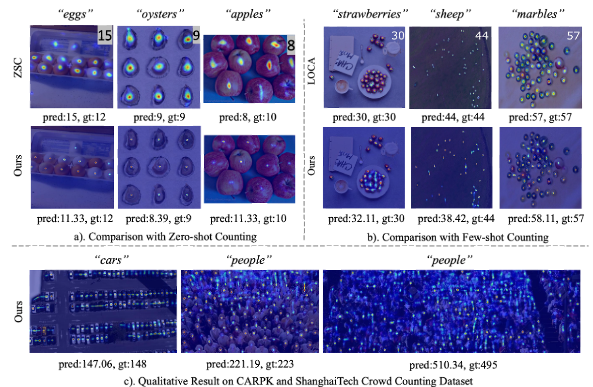

# CLIP-Count

Official Implementation for CLIP-Count: Towards Text-Guided Zero-Shot Object Counting
teaser image.

TL;DR: We count anything with text descriptions.
## Code
To be released soon.

## Citation
```
@misc{jiang2023clipcount,
      title={CLIP-Count: Towards Text-Guided Zero-Shot Object Counting},
      author={Ruixiang Jiang and Lingbo Liu and Changwen Chen},
      year={2023},
      eprint={2305.xxxxx},
      archivePrefix={arXiv},
      primaryClass={cs.CV}
      }

```
